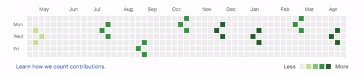

# contrib-awakens

Play games in GitHub's contribution graph.

1. Install the [Chrome extension](https://chrome.google.com/webstore/detail/contrib-awakens/ghdkhcgdgpapfcgkbchkdplfmchnglcg)
2. Go to any GitHub profile page, e.g [github.com/Zhouzi](https://github.com/zhouzi)
3. The contribution graph is replaced by a random game everytime you load the page

contrib-awakens is a Chrome extension that uses GitHub's contribution graph as a rendering layer.
Among the few games available, a random one is picked every time you load a profile page.

The instructions on how to play are logged in the console.

* [Chrome Extension](https://chrome.google.com/webstore/detail/contrib-awakens/ghdkhcgdgpapfcgkbchkdplfmchnglcg)
* [Contributing](CONTRIBUTING.md)
